# 项目成果

- 用户登录界面：
    1. 注册
       
    2. 登录
       
    3. 找回密码（用户名）
       

- 首页视频流：
  

- 视频详细界面：
    1. 播放器
        1. 分块功能A（gif大小限制）
           
        2. 分块功能B
           
    2. 视频简介及相似视频推荐
       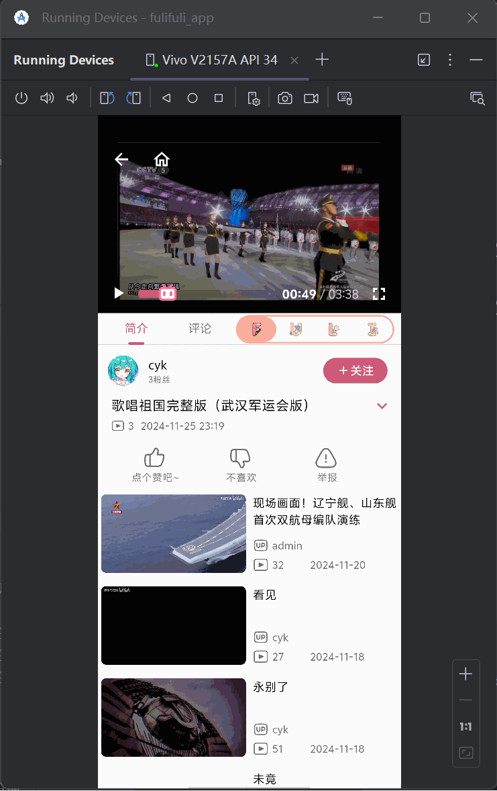
    3. 点赞及举报
       
    4. 视频评论区
        1. 评论及其子评论
           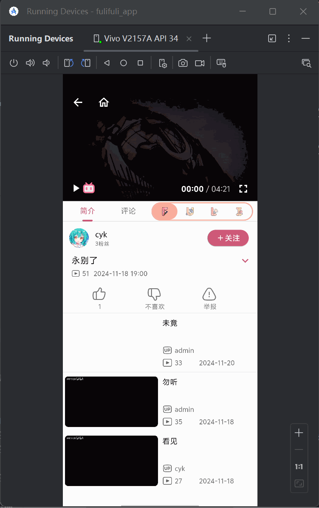
        2. 回复评论的快速定位
           
        3. 评论视频
           
        4. 回复评论
           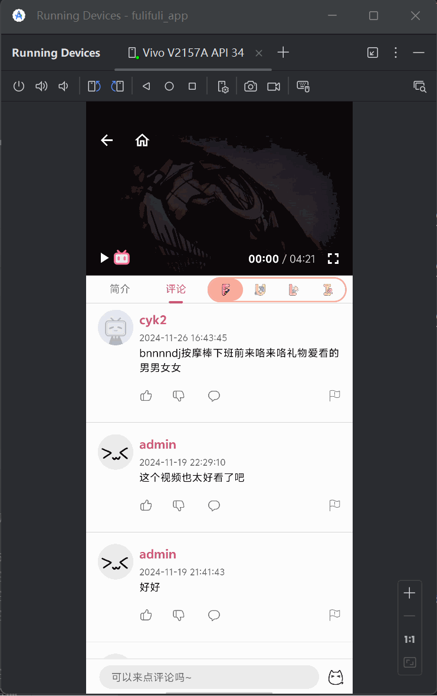
        5. 评论的点赞及举报
           

- 视频卡片集成举报、不感兴趣：
  

- 搜索界面：
  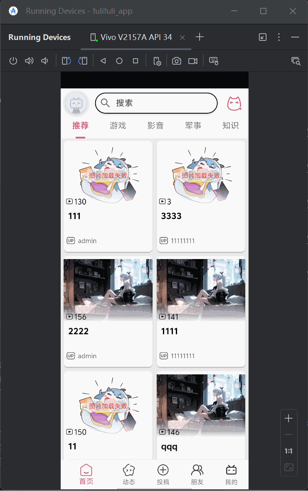

- 动态界面：
    1. 动态流
       
    2. 动态画廊
       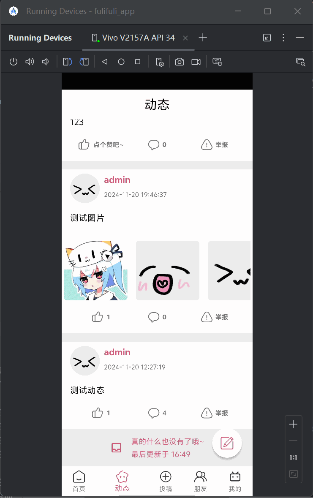
    3. 发布动态
       
    4. 动态评论区（同视频）
       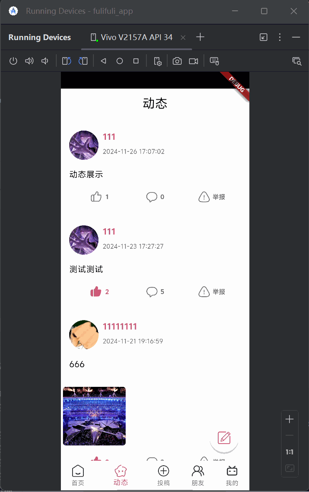

- 朋友、关注、粉丝列表界面：
  

- 投稿界面：
    1. 分块功能A（gif大小限制）
       
    2. 分块功能B
       
    3. 分块功能C
       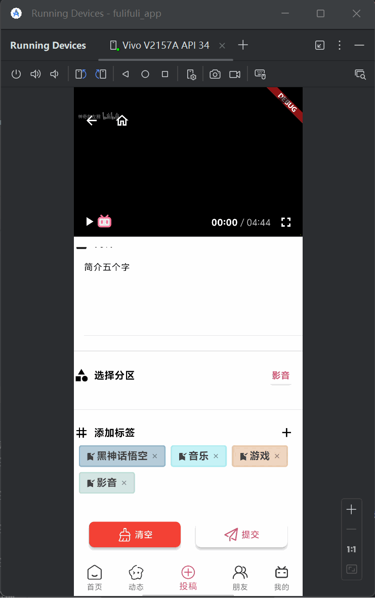

- 个人空间：
    1. 自己的空间
       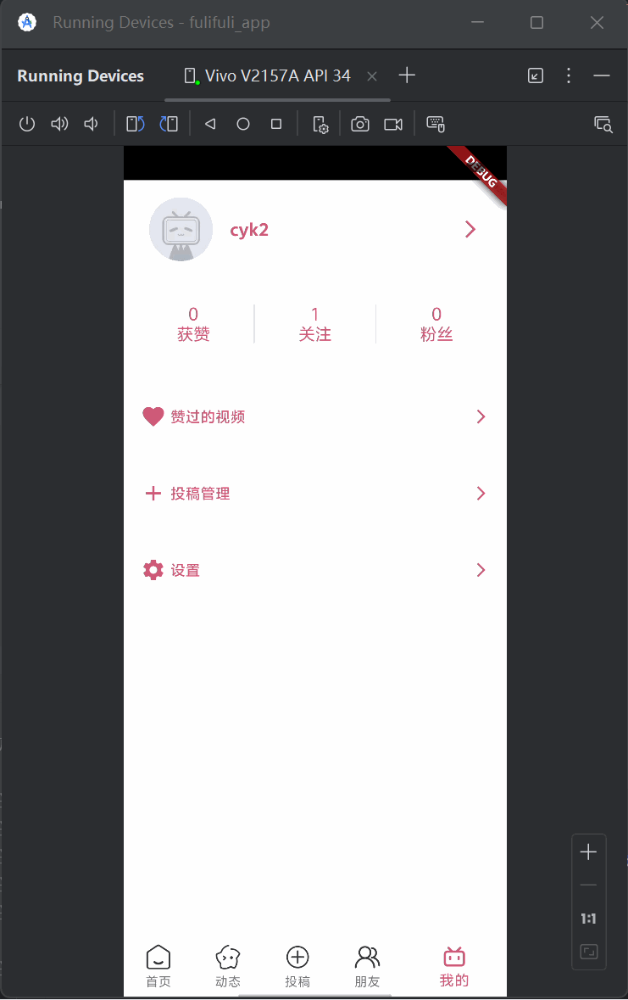
    2. 别人的空间
       
    3. 通过空间查看粉丝或关注列表
       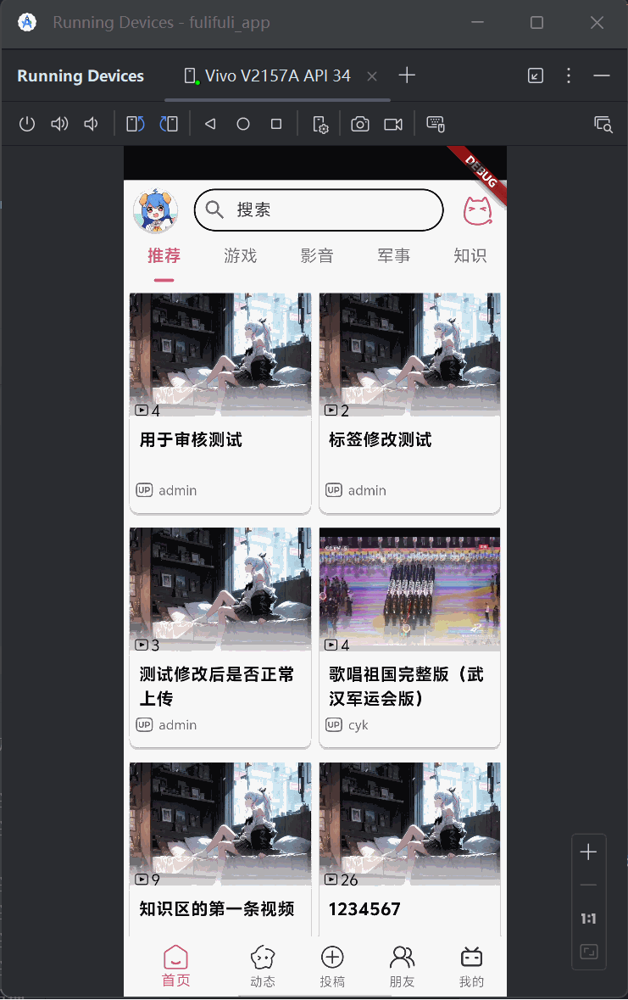
    4. 空间内可跳转视频或评论动态
       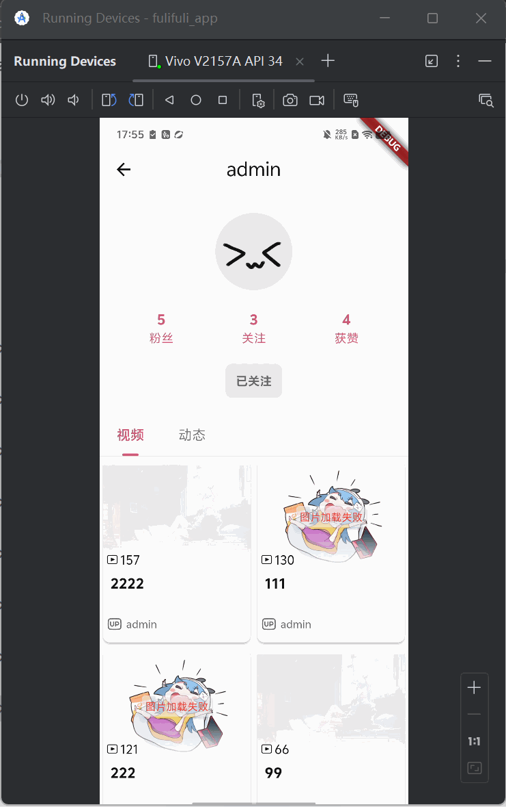

- 查看投稿状态：
  

- 查看赞过的视频：
  

- 设置界面：
    1. 深色模式切换
       
    2. 主题色切换
       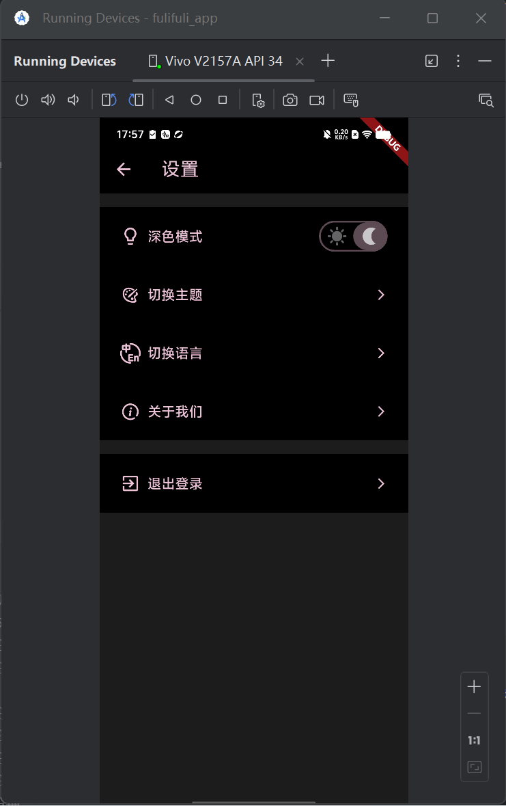
    3. 语言切换
       
    4. 退出登录
       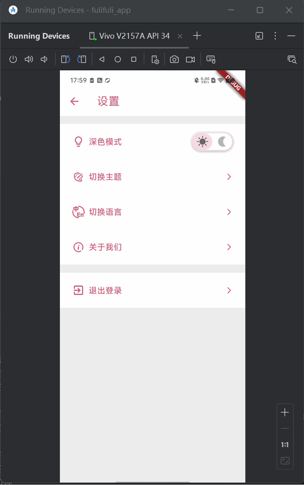